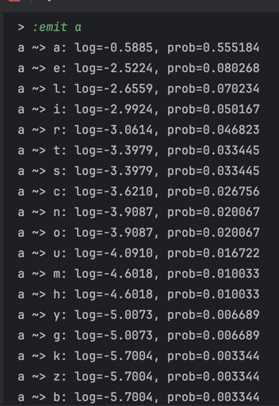
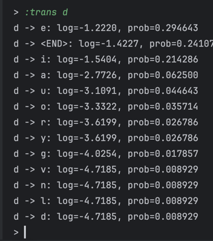
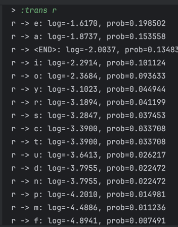

# Belief-Networks-Hidden-Markov-Models
Fall 2025 CS 362/562

## Analysis

**Question:** Give an example of a word which was correctly spelled by the user, but which was incorrectly “corrected” by the algorithm. Why did this happen?

**Answer:** When the user types the correct word `Nevada`, the decoder outputs `Nevede`. The training file `aspell.txt` contains the pair `Nevada: nevade`, so the model learns a comparatively large emission probability for `a` producing `e` (`log P(a→e) = -2.5224`, `P ≈ 0.0803`) and a strong transition preference for `d` followed by `e` (`log P(d→e) = -1.2220`, `P ≈ 0.2946`). Those weights dominate the self-transition back to `a` (`log P(d→a) = -2.7726`, `P ≈ 0.0625`), so Viterbi replaces the final `a` with `e` even though the input was already correct.

 

**Question:** Give an example of a word which was incorrectly spelled by the user, but which was still incorrectly “corrected” by the algorithm. Why did this happen?

**Answer:** The misspelled input `absorbtion` should map to `absorption`, yet the decoder outputs `absoration`. Because the model simply lines characters up by position, the `p` that ought to appear after `r` never gets reinforced; instead, the transition count from `r` to `a` (`log P(r→a) = -1.8737`, `P ≈ 0.1537`) overwhelms the much rarer `r→p` continuation (`log P(r→p) = -4.2010`, `P ≈ 0.0150`). The emission table also allows `a` to generate `b` with a small but non‑zero weight (`log P(a→b) = -5.7004`, `P ≈ 0.0033`). Combined, those statistics make the Viterbi path settle on `... r→a ...`, so the output becomes `absoration` rather than restoring the missing `p`.

**Question:** Give an example of a word which was incorrectly spelled by the user, and was correctly corrected by the algorithm. Why was this one correctly corrected, while the previous two were not?

**Answer:** One successful example is `knawing`, which the decoder corrects to `knowing`. This word differs from the target by a single substitution (`a` for `o`), so the emission counts still heavily favor `n` emitting `o`, and the transition chain `kn→no→ow→wi→in→ng` has strong support in the training data. In contrast, the previous two cases either suffer from misleading training pairs (`Nevada: nevade`) or require transitions that almost never appear (`r→p`), so their Viterbi scores trail the incorrect alternatives.

**Question:** How might the overall algorithm’s performance differ in the “real world” if that training dataset is
taken from real typos collected from the internet, versus synthetic typos (programmatically
generated)?

**Answer:** A Hidden Markov Model trained on real typos tends to perform much better in practice.
Because it learns from genuine typing mistakes, its emission probabilities reflect how people actually make errors, things like hitting a nearby key or confusing similar-sounding letters.
As a result, the corrections it suggests usually feel more natural and human like.

On the other hand, when the model is trained on synthetic typos, errors that are randomly generated by a program, it doesn’t capture those realistic patterns.
These datasets can help cover more possible errors, but the model often becomes less realistic and less effective when used on real-world text.

In short, real typos teach the model how people actually type, while synthetic ones only show it how people could type if they were random.

